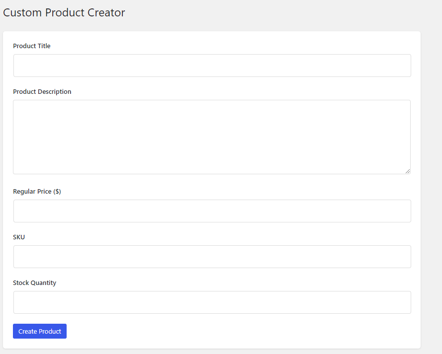
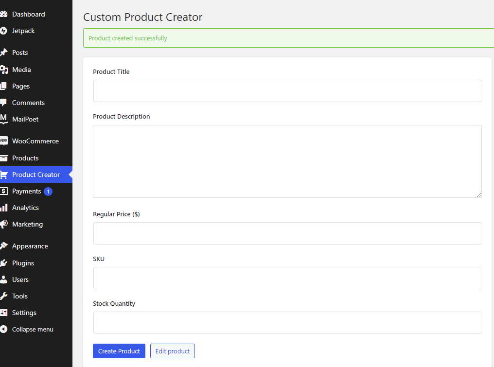

# Custom WooCommerce Product Creator

## Overview
The Custom WooCommerce Product Creator is a WordPress plugin that simplifies the process of adding new products to your WooCommerce store. It provides a streamlined interface for creating products without navigating through multiple screens.

## Features
- **Simple Interface**: Clean and user-friendly form for product creation
- **Quick Creation**: Add products with essential details in one step
- **AJAX Processing**: Create products without page refresh
- **Key Product Details**:
  - Product title
  - Product description
  - Regular price
  - SKU
  - Stock quantity
- **Security Features**:
  - Nonce verification
  - User capability checks
  - Input sanitization
- **Responsive Design**: Works smoothly on all devices

## Installation
1. Download or clone the repository to your WordPress plugins folder:
```bash
git clone https://github.com/your-username/custom-product-creator.git
```
2. Navigate to WordPress admin → Plugins → Add New → Upload Plugin
3. Upload the plugin zip file
4. Activate the plugin
5. Ensure WooCommerce is installed and activated

## Requirements
- WordPress 5.0 or higher
- WooCommerce 6.0 or higher
- PHP 7.2 or higher

## Usage
1. After activation, find "Product Creator" in your WordPress admin menu
2. Fill in the required product details:
   - Product Title
   - Description
   - Regular Price
   - SKU
   - Stock Quantity
3. Click "Create Product"
4. Once created, you'll see a success message with a link to edit the product

## Screenshots
1. **Product Creator Form**:


2. **Success Message**:


## File Structure
```
custom-product-creator/
├── assets/
│   ├── css/
│   │   └── admin.css
│   └── js/
│       └── admin.js
├── languages/
├── templates/
│   └── creator-form.php
├── custom-product-creator.php
└── readme.md
```

## Security Features
- Form inputs are properly sanitized
- AJAX requests are verified with nonces
- Admin page access is restricted to users with proper capabilities
- Input validation on both client and server side

## Changelog
### 1.0.0 (2024-01-02)
- Initial release
- Basic product creation functionality
- AJAX form handling
- Responsive design
- Translation support

## Contributing
1. Fork the repository
2. Create your feature branch:
```bash
git checkout -b feature/amazing-feature
```
3. Commit your changes:
```bash
git commit -m 'Add amazing feature'
```
4. Push to the branch:
```bash
git push origin feature/amazing-feature
```
5. Submit a pull request

## Future Updates
- Support for variable products
- Image upload functionality
- Product categories and tags
- Bulk product creation
- Custom fields support

## Support
For support or bug reports, please create an issue in the GitHub repository.

## License
This project is licensed under the GPL v2 or later.

---
Feel free to customize this README according to your specific implementation and details!

This README provides a comprehensive overview of your plugin while maintaining a professional and organized structure. It includes all necessary information for users and potential contributors.